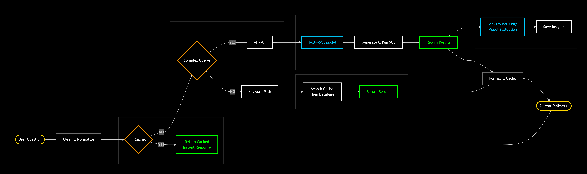

# AI Architecture Deep Dive

## API Endpoint

The AI implementation is accessible at: [http://localhost:3000/api/ai/query](http://localhost:3000/api/ai/query)

## System Flow

 

### 1. Query Reception
When a user interacts with the AI chatbot by sending a query, the application executes the following decision tree.

### 2. Cache Check
The application first checks if the exact query was sent within the past 5 minutes:
- **Cache HIT**: Returns cached results immediately
- **Cache MISS**: Proceeds to complexity analysis

### 3. Query Classification
The application determines whether the user prompt requires AI assistance:

#### A. Keyword Search Path (Low Complexity)
If the query is not complex enough to need the TEXT2SQL_MODEL:
1. Check for cached table data
2. If cache MISS, query searchText fields (pre-optimized for rapid lookup)
3. Store both query (as key) and results in cache
4. Proceed to response generation

#### B. AI Path (High Complexity)
If the TEXT2SQL_MODEL is required:
1. Send user query to TEXT2SQL_MODEL
2. Convert natural language to SQL
3. Execute generated SQL against PostgreSQL
4. Proceed to response generation

### 4. Response Generation
Two result paths converge at the AI_RESPONSE_MODEL:
- **Keyword search results**
- **AI-generated query results**

The response model converts raw data into human-friendly format before returning to the frontend chatbot.

### 5. Non-Blocking Evaluation
The JUDGE_MODEL operates asynchronously, not blocking user response:

#### Evaluation Logic
- **Test set matches**: If query matches `src/server/aiTest/test-questions.json`, compare resultsCount against expected count from ground truth
- **No match**: LLM-as-Judge autonomously evaluates quality

#### Output
Scores and explanations are saved to: 
src/server/aiTest/judgements/

## Important Notes

> **Disclaimer**: This flow prototypes a production pipeline but was developed in under one month. It demonstrates architectural patterns rather than production-ready robustness. Each step mimics real-world behavior but lacks the comprehensive error handling, validation, and optimization required for production deployment.

## Related Documentation
- [Main README](README.md) - Project overview
- [Setup Guide](setup.md) - Comprehensive setup guide
- [GPU + Model Notes](gpu-model-notes.md) - Model specifications and VRAM requirements 
