# Experimental Offline bunOllama AI Branch

This setup is configured for **Linux Ubuntu 22.04 / WSL2** with an **NVIDIA GPU with at least 24GB VRAM (e.g., RTX 4090)**. Before proceeding, please research the capabilities and limitations of your hardware (GPU VRAM, system RAM, CPU cores) and intended AI model(s).

> **Note**: This can be customized for use with computers that run models only on CPU, but you will have to change configuration in `docker-compose.yml` and research settings for your specific setup.

## Table of Contents
- [System Requirements](#system-requirements)
- [Software Prerequisites](#software-prerequisites)
- [NVIDIA GPU Support](#nvidia-gpu-support)
- [Configuration Files](#configuration-files)
- [Model Architecture](#model-architecture)
- [Sample .env Configuration](#sample-env-configuration)
- [docker-compose.yml](#docker-composeyml)
- [start-dev.sh](#start-devsh)
- [Downloading Models from HuggingFace](#downloading-models-directly-from-huggingface)
- [switch-model.sh](#switch-modelsh)
- [Installing Bun](#installing-bun)
- [Resolving Port Conflicts](#resolving-port-conflicts)
- [Application One-Time Setup](#application-one-time-setup)
- [Running the Application](#running-the-application)
- [pgAdmin Walkthrough](#pgadmin-walkthrough)
- [Endpoints](#endpoints)

## System Requirements

### Minimum Hardware (CPU-Only)

- **RAM:** 16GB (32GB+ recommended for models >7B parameters)
- **Storage:** 50GB free space for Docker images and models
- **CPU:** 4+ cores recommended

### Recommended Hardware (GPU-Accelerated)

- **NVIDIA GPU with:**
  - Minimum 8GB VRAM for 7B parameter models
  - **24GB VRAM** (like RTX 4090) for preloading multiple models
  - CUDA Compute Capability 7.0+ (RTX 20 series or newer)

## Software Prerequisites

Resources: [Ollama Docker Documentation](https://docs.ollama.com/docker)

## Essential

- **Docker Desktop** (preferably v4.40+) or **Docker Engine** (v24.0.0+)
  - Verify with: `docker --version`
- **Docker Compose** (preferably v3.8+) - included with Docker Desktop
  - Verify with: `docker compose version`

### Linux/WSL2 Specific

- Ubuntu 22.04 (or compatible distribution)

## NVIDIA GPU Support

If using an NVIDIA GPU (recommended for better performance):

### Required NVIDIA Components

- **NVIDIA Driver** (version 535+ recommended for better stability)

  > **Note**: CUDA version will also affect driver version. For example, CUDA 13.0 requires minimum driver version of 580.65 on Linux/Windows.

- **CUDA Support** - The Ollama Docker image includes CUDA, but your host needs compatible drivers.

  Verify your driver version and maximum compatible CUDA version with: `nvidia-smi`

  > **Important**: The CUDA Version displayed is NOT the CUDA version installed but shows the latest version compatible with your driver version.

  See: [Nvidia Driver version and CUDA](assets/02_nvidia-driver-cuda.png)

- **NVIDIA Container Toolkit** - Required for GPU access within Docker containers.
  - Installation guide: [NVIDIA Container Toolkit Installation](https://docs.nvidia.com/datacenter/cloud-native/container-toolkit/latest/install-guide.html)

### Verify GPU Access

After installing the NVIDIA Container Toolkit, verify Docker can access your GPU:

#### 1. Make sure Docker is running
`docker ps`

#### If Docker isn't running, start it:
`sudo systemctl start docker`

#### 2. Test GPU access
`docker run --rm --gpus all nvidia/cuda:<your CUDA version>-ubuntu22.04 nvidia-smi`

#### Example:
`docker run --rm --gpus all nvidia/cuda:12.2.0-base-ubuntu22.04 nvidia-smi`

#### 3. If successful, you'll see your GPU information displayed

## Configuration Files

You must customize the following files to reflect your chosen Ollama configuration and AI models:

- `docker-compose.yml`: Ollama and backend service setup
- `.env`: Environment variables
- Optional scripts:
  - `start-dev.sh`: Model preloading script
  - `switch-model.sh`: Model switching utility

### Model Architecture

The current setup allows pre-loading for 2 models:

- **Model #1**: Converts user's prompt to SQL query
- **Model #2**: Performs dual tasks:
  1. Generates a human-friendly response from results returned from user's prompt
  2. Evaluates results by:
     - Comparing results count to expected count using 'ground truth' test set answers (imperfect but sufficient for mimicking the workflow)
     - Acting as LLM-as-Judge

### Sample .env Configuration

```env
TEXT2SQL_MODEL=distil-qwen3-4b:latest
AI_RESPONSE_MODEL=qwen2.5-coder:7b
JUDGE_MODEL=qwen2.5-coder:7b  # Can change to a different model as preferred if don't want to use same model as dual purpose
MODEL_URL=http://ollama:11434/v1/chat/completions  # OpenAI-compatible endpoint
```
### docker-compose.yml
Comments have been added to docker-compose.yml to show how ollama and backend is configured for local AI setup with Nvida GPU capability. Other options have been added in the comments.

### start-dev.sh
`start-dev.sh` is a Linux-based preloading script to warm 2 models and start the application. Run this script ONLY if your GPU has enough capacity to preload 2 models (see model VRAM requirements section) and only AFTER you have already done 1st-time setup. 

Preloading and warming models avoids forcing users to wait for models to load before running. It also prevents truncated AI model responses (due to models not being completely warmed up) and gives more consistency in AI model response behavior.

You can either pull models via ollama (using `start-dev.sh`) or download directly from HuggingFace. Some models have certain permissions set up that might interrupt the download process if you attempt to pull directly with ollama. 

### Downloading models directly from HuggingFace

If you download from HuggingFace, you will also need to create a Modelfile. 

#### 1. First, make sure Ollama is running
`docker compose ps ollama`

#### 2. If not already running, start ollama in docker
`docker compose up -d ollama`

#### 3. Create Modelfile with the correct filename
`docker compose exec ollama sh -c "echo 'FROM /root/.ollama/models/qwen2.5-coder-7b-instruct-q4_k_m.gguf' > /root/Modelfile-qwen2.5_coder_7b"`

#### 4. Create the model
`docker compose exec ollama ollama create qwen2.5_coder_7b -f /root/Modelfile-qwen2.5_coder_7b`

#### 5. Verify your list of models
`docker compose exec ollama ollama list`

After customizing start-dev.sh to your preferred AI models, make the script executable by running: 
`chmod +x start-dev.sh`

 
### switch-model.sh
`switch-model.sh` enables switching of txt2SQL models. 

This script overwrites the .env file so that `TEXT2SQL_MODEL` variable is changed.
It also verifies models are pulled and restarts the backend Docker container.

Make script executable by running `chmod +x switch-model.sh`. 


## Installing bun

Ensure you are running Ubuntu 22.04 or later in WSL. You can check your version using `lsb_release -a` in the Ubuntu terminal.

### 1. Update your package lists:
`sudo apt update`

Bun requires the unzip package to be installed:
`sudo apt install unzip`
 
### 2. Installation Steps
Run the Bun installation script in your Ubuntu terminal:
`curl -fsSL https://bun.sh/install | bash`
This script downloads and installs the latest stable version of Bun.

### 3. Add Bun to your system's PATH 
The installation script will typically output the lines you need to add to your shell's configuration file (commonly ~/.bashrc for Ubuntu's default shell).
Open your configuration file with a text editor (e.g., nano):
`nano ~/.bashrc`

### 4. Add the following lines to the very end of the file:
`export BUN_INSTALL="$HOME/.bun"`
`export PATH="$BUN_INSTALL/bin:$PATH"`
Save the file and exit the editor (in nano, press Ctrl+O, then Enter, then Ctrl+X).

### 5. Verify installation
`bun --version`

## Application One-Time Setup

 **Research** your hardware capabilities and limitations
**Customize** configuration files:
`.env `- Set your model preferences
`docker-compose.yml` - Adjust GPU/CPU settings if needed
`start-dev.sh` and `switch-model.sh` (optional)
**Manually** create judgments folder inside of aiTest (if not present). It probably should automatically create a judgments folder when an evaluation is made, but I have not yet tested  this.

**Run initial setup** (installs dependencies, creates containers, seeds database):
`bun i && bun run setup`


## Resolving Port Conflicts

If you encounter port conflicts during setup, particularly with port `5432` (PostgreSQL) or port `11434` (Ollama), follow these steps to identify and resolve the issue.

### 1. Identify the Process Using the Port

First, determine which process is occupying the port you need:

**Linux/macOS:**
```bash
# Check port 5432 (PostgreSQL)
sudo lsof -i :5432

# Check port 11434 (Ollama)
sudo lsof -i :11434
The output will show the Process ID (PID) and the name of the application using the port.
```

### 2. Resolve the Port Conflict
Once you've identified the process, you have 2 options to resolve the conflict:

#### Option A: Stop the Conflicting Service
If the port is being used by a local service you don't need running simultaneously:

```bash
For PostgreSQL (port 5432):

# Stop PostgreSQL service
sudo systemctl stop postgresql
For Ollama (port 11434):


# Stop Ollama service
sudo systemctl stop ollama
```

#### Option B: Use a Different Port for Your Container
Alternatively, you can configure your application to use a different port by modifying the port mapping in `docker-compose.yml`.

## Running the application

If you have GPU capacity (see model VRAM requirements), it is recommended to run:
`./start-dev.sh` to preload and warm 2 models and start the application
You can switch `TEXT2SQL_MODEL` as such:
`./switch-model.sh arctic` # switch to arctic model

Otherwise, run `docker compose up -d`
To stop the application, run:
`docker compose down`

Note: the `--watch` flag with docker compose up can sometimes interfere with model running processes (causing AI model to be interrupted when running).

### If making changes to backend, it’s best to do the following steps:
```bash
docker compose stop backend
docker compose rm -f backend
docker compose up -d --build backend
To debug, use another terminal to check logs:
docker compose logs -f backend
```

## pgAdmin walkthrough

### How to Connect pgAdmin to Your Docker PostgreSQL:
Setting up pgAdmin
```To see local postgres database, log in at pgAdmin http://localhost:5050/browser/ 
UN: admin@admin.com
PW: root
```

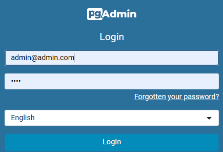

### Step 1: Click Add New Server (middle left)

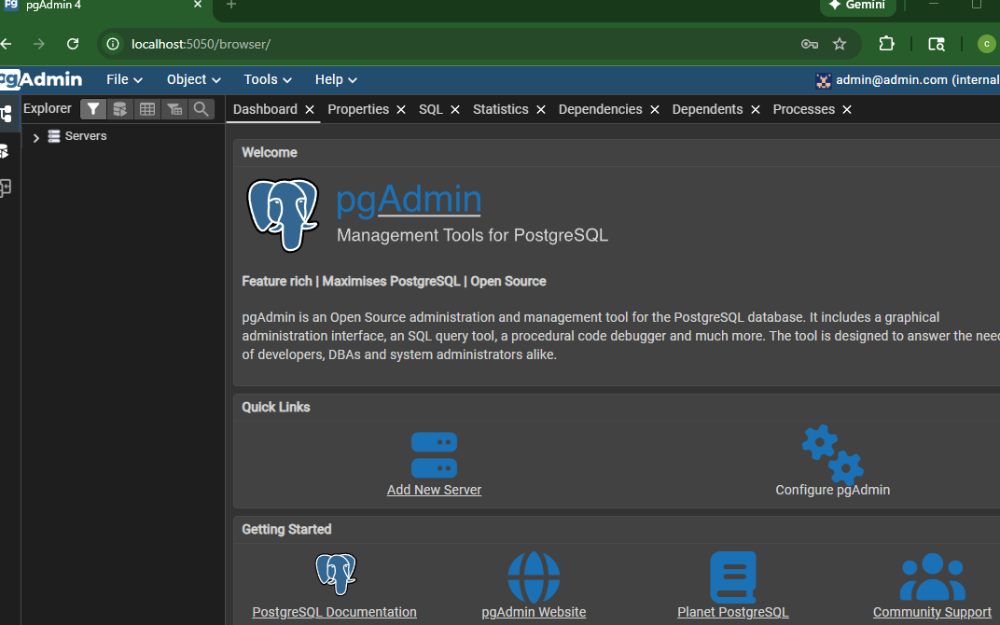


### Step 2: Configure Connection
General Tab:
`Name: localDB (or any name you want)`
Keep everything else the same

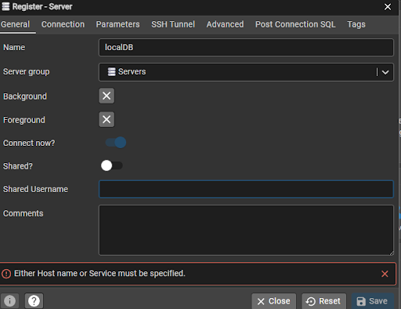

Connection Tab:
```Host name/address: db (← This is important!)
Port: 5432
Maintenance database: test_db
Username: root
Password: root
☑ Save password? (optional)
Click Save
```

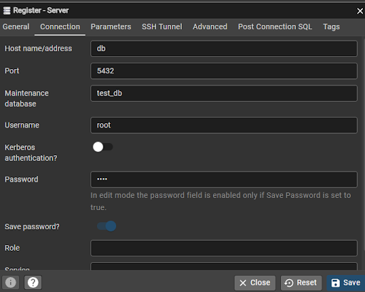

### How set up db server looks

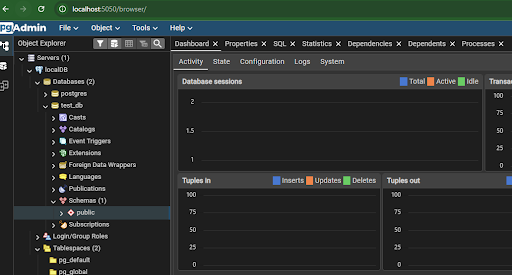

### Step 3: Connect to local server

Click on Query Tool Workspace icon on left sidebar:

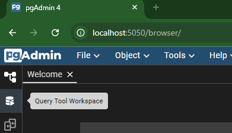

Connect to existing db server with these credentials & click the connect button at bottom right:

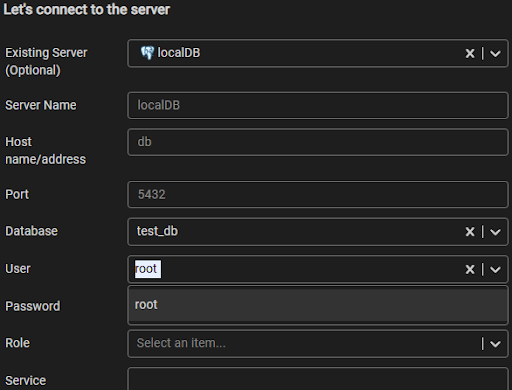


### Step 4: Run a query 
`SELECT * FROM "allTrustFaqs";`

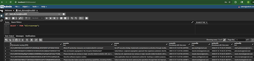


### Step 5: view ER Diagram
Click top upper left icon to switch to Default Workspace view

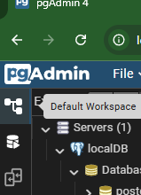

You can either right-click public (if exists), then select ERD for Schema

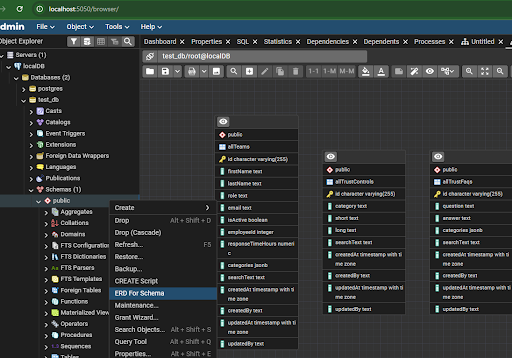

Or right-click `test_db` then select ERD for Schema

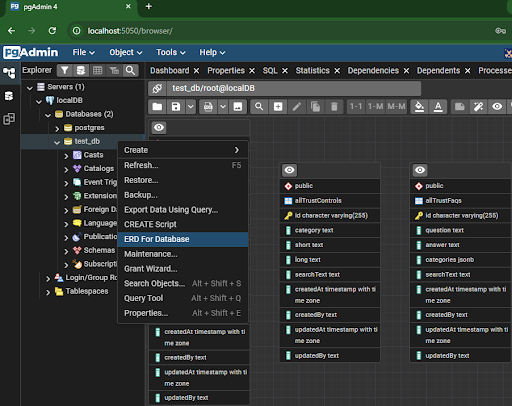

ERD diagram looks like this:

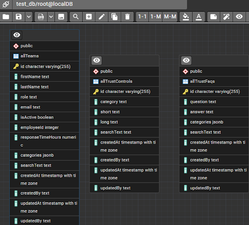

## Endpoints

Frontend: http://localhost:5173/

Local postgres database: pgAdmin http://localhost:5050/browser/ 

Various backend routes: http://localhost:3000/api/ 


### Cache endpoints
http://localhost:3000/api/admin/clear-cache 
All cache has expiration time. This POST endpoint manually clears cache for tables like 'teams', 'controls', 'faqs', and ‘search’. If left empty, it will clear all cache

`Examples: {"type": ""} to clear all or {"type": "teams"} to clear specific keys`


http://localhost:3000/api/admin/cache-stats 
shows all cache stats

This application implements simple in-memory caching (NodeCache), based on cache-aside pattern where the application first checks cache and only queries the database if there’s a cache miss.

Initial GET requests for allTrustFaqs, allTrustControls, and allTeams that query the database will automatically store results to cache. All cache has an automatic expiration of 5 minutes. This can be changed in cache.ts.

Subsequent GET requests within 5 minutes of caching will retrieve cached results (cache HIT) rather than re-querying the database. If cache is cleared of expired, any cache MISS will result in a database query.

## AI Implementation endpoint
The AI chatbot backend endpoint is at http://localhost:3000/api/ai/query 


- [README](README.md) - Project overview
- [AI Architecture Deep Dive](ai-architecture.md) - Detailed AI flow documentation
- [GPU + Model Notes](gpu-model-notes.md) - Model specifications and VRAM requirements